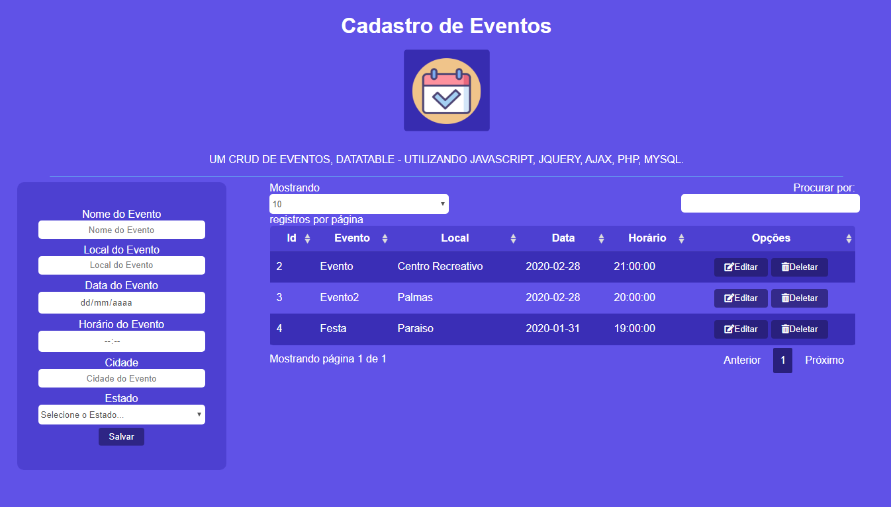

# php-ajax-datatable

<div align="center">
  </img>
</div>

## Aplicação PHP E JAVASCCRIPT

Projeto, sistema de cadastramento de eventos, em PHP e Javascript.

## Informações Gerais

- Para o funcionamento correto desta aplicação deve-se alterar as variáveis de ambiente do arquivo conexao de acordo com os parâmetro do seu app, xampp, ou wampserver, caso seja necessário.

## Instalação

Para que o projeto funcione corretamente você deverá clonar o projeto e inicializá-lo por meio do xampp, ou wampserver.

```
$hostname = 'localhost';
$user = 'root';
$password = '';
$database = 'crud-event';
```

## Obs:
#### Deve-se criar a base de dados e as tabelas de acordo com os parâmetros aqui expressos:

```
database: crud-event
tabelas: events, estados
```

## table-events
```
id:int
nome_evento: varchar(25)
local_evento: varchar(20)
cidade_evento: varchar(15)
estado_evento: char(2)
data_evento: Date
```

## table-estados
```
id:int
nome:varchar(20)
sigla:char(2)
```

### obs
Insira os dados de estados manualmente para que a listagem de estados apareça no formulário de cadastro,
e cadastre um evento qualquer para que a listagem de eventos no datatable funcione, isso poderá ser feito através do painel do phpMyAdmin. 

## Página Home
</img>

## Licença

[MIT](./LICENSE) .